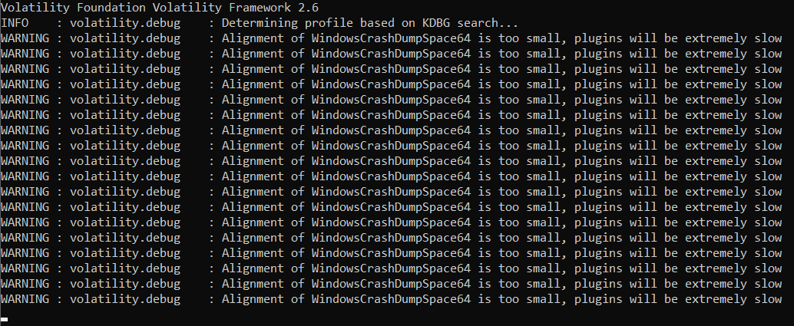

# HKCERT CTF 2022 Writeup: Clipboard (200 points, 22 solves)

Category: **Forensic ★★★☆☆**

### Challenge Description

> My friend has store the flag in clipboard. Please help me to find the flag out.
> 

Attachment: [clipboard_362a16105107d594bead3fd7df2d3458.zip](https://file.hkcert22.pwnable.hk/clipboard_362a16105107d594bead3fd7df2d3458.zip)

## Getting Started

This is my first time working on memory dump file, so the best start is to investigate the files provided. 

After unzipping the attachment, wow, there is a big file `Windows 7 x64.mem` (512MB), containing `.mem` extension that I have never seen before. Let me ask Google god what is this.

> MEM files allow memory data to be saved and restored at a later time.
> 

After some Googling, it seems that the file is called a memory dump which contains the snapshot of the memory status that allows others to investigate the memory at that particular time point later on.

Another question has arrived, how do we open the memory dump and explore it?

## Volatility

Google shows that there is a popular tool called ********************volatility******************** that allows users to investigate the memory dump file and reveal the stored data.

Installing volatility is a bit troublesome, there are [volatility 2](https://github.com/volatilityfoundation/volatility), [volatility 3](https://github.com/volatilityfoundation/volatility3/releases/tag/v1.0.0), they are the mostly same but just upgraded the python core as specified in the name. 

More information could be found on volatility’s homepage: [Volatility Foundation](https://www.volatilityfoundation.org/) and their [GitHub](https://github.com/volatilityfoundation).

Since my Kali has some issues, so I actually use the [standalone version portable version (Python 2.6)](https://www.volatilityfoundation.org/releases).

## Using Volatility to investigate the `.mem`

Since volatility is a popular tool, there are already tons of tutorials online teaching the most common command of using volatility to examine the file. 

The usual practice is always to apply `imageinfo` command on the image file to understand the image profile of the memory dump so that volatility knows how to interpret the memory data.

*Note: I renamed the executable for easier reading.*

```bash
volatility.exe -f "Windows 7 x64.mem" imageinfo
```

Running this usual starter command seems encountered some issues, it prints these warnings and got stuck.



After some runtime, volatility finally gave us the suggested profiles:

```
Suggested Profile(s) : Win8SP0x64, Win10x64_14393, Win81U1x64, Win2012R2x64_18340, Win10x64_10586, Win10x64, Win2016x64_14393, Win2012R2x64, Win2012x64, Win8SP1x64_18340, Win8SP1x64 (Instantiated with Win8SP1x64)
                     AS Layer1 : WindowsAMD64PagedMemory (Kernel AS)
                     AS Layer2 : WindowsCrashDumpSpace64 (Unnamed AS)
                     AS Layer3 : FileAddressSpace (C:\...\Windows 7 x64.mem)
                      PAE type : No PAE
                           DTB : 0xbc5c000L
                          KDBG : 0xf800029e6120L
          Number of Processors : 2
     Image Type (Service Pack) : 1
                KPCR for CPU 0 : 0xfffff800029e8000L
                KPCR for CPU 1 : 0xfffff88002f00000L
             KUSER_SHARED_DATA : 0xfffff78000000000L
           Image date and time : 2022-09-08 03:04:08 UTC+0000
     Image local date and time : 2022-09-08 11:04:08 +0800
```

Great! Let’s try with the profiles suggested:

```bash
volatility.exe -f "Windows 7 x64.mem" --profile=Win8SP0x64 pstree
```

This returns:


Hmm…. it seems there are some issues with volatility’s image profile suggestion, how about we tap into the information given by the problem and supply the correct one?

## Getting the correct image profile

From the file name: `Windows 7 x64.mem` it makes sense to give a try on the Windows 7 profiles.

On the [volatility Windows profiles page](https://github.com/volatilityfoundation/volatility/wiki/2.6-Win-Profiles), there are only two Win7 x64 profiles, namely `Win7SP1x64_23418` and `Win7SP1x64_24000`.

Retry with the potential profiles and we can use some commands:

```bash
volatility.exe -f "Windows 7 x64.mem" --profile=Win7SP1x64_23418 pstree
```

This works and returns the following:


However, image profile `Win7SP1x64_24000` does not work, since volatility2 (vol2) is last maintained in 2016 while `Win7SP1x64_24000` is dated 2018-01-09. (Credit to dearest my teammate who has a hard life!)

## Extracting Clipboard data

Since the challenge’s name is *Clipboard*, my first thought is whether there is any commands related to clipboard. **やっぱり!** Here is one:

```bash
volatility.exe -f "Windows 7 x64.mem" --profile=Win7SP1x64_23418 clipboard
```

It took the program some time to return the following:


But where is the data? (Data呢_你?)

It turns out that we need to add argument `-v` or `-verbose` to print out the data

```bash
volatility.exe -f "Windows 7 x64.mem" --profile=Win7SP1x64_23418 clipboard -v
```

After some runtime, console returns a bunch of data for every clipboard item, the last one is exceptionally large that the console cannot print it out. We need to export it, which can be achieved with the following command:

```bash
volatility.exe -f "Windows 7 x64.mem" --profile=Win7SP1x64_23418 clipboard -v > clipboard_output.txt
```

**TODO: Add the link to the txt in GitHub**

## Investigate the exported data

Looking at the clipboard data, well well well, the last item is so large that we can pay extract attention to it.

When doing forensic, one important skill is the remember the header of different file formats. Here is a (Simplified) Chinese [source](https://blog.csdn.net/qq_42196196/article/details/83097494) with a summary of different common file formats.  

Anyway, in this challenge, we can easily observe that the last clipboard item has a **RTF header (7B5C727466)**

```bash
1 ------------- ------------------            0x7010d 0xfffff900c3600000                                                   
0xfffff900c3600014  7b 5c 72 74 66 31 5c 61 6e 73 69 5c 61 6e 73 69   {\rtf1\ansi\ansi
0xfffff900c3600024  63 70 67 31 32 35 32 5c 64 65 66 66 30 5c 64 65   cpg1252\deff0\de
0xfffff900c3600034  66 6c 61 6e 67 31 30 33 33 7b 5c 66 6f 6e 74 74   flang1033{\fontt
0xfffff900c3600044  62 6c 7b 5c 66 30 5c 66 6e 69 6c 5c 66 63 68 61   bl{\f0\fnil\fcha
0xfffff900c3600054  72 73 65 74 30 20 43 61 6c 69 62 72 69 3b 7d 7d   rset0.Calibri;}}
0xfffff900c3600064  0d 0a 7b 5c 2a 5c 67 65 6e 65 72 61 74 6f 72 20   ..{\*\generator.
0xfffff900c3600074  4d 73 66 74 65 64 69 74 20 35 2e 34 31 2e 32 31   Msftedit.5.41.21
0xfffff900c3600084  2e 32 35 31 30 3b 7d 5c 76 69 65 77 6b 69 6e 64   .2510;}\viewkind
0xfffff900c3600094  34 5c 75 63 31 5c 70 61 72 64 5c 73 61 32 30 30   4\uc1\pard\sa200
0xfffff900c36000a4  5c 73 6c 32 34 30 5c 73 6c 6d 75 6c 74 31 5c 6c   \sl240\slmult1\l
0xfffff900c36000b4  61 6e 67 39 5c 66 30 5c 66 73 32 32 7b 5c 70 69   ang9\f0\fs22{\pi
0xfffff900c36000c4  63 74 5c 77 6d 65 74 61 66 69 6c 65 38 5c 70 69   ct\wmetafile8\pi
0xfffff900c36000d4  63 77 31 30 35 38 33 5c 70 69 63 68 31 30 35 38   cw10583\pich1058
0xfffff900c36000e4  33 5c 70 69 63 77 67 6f 61 6c 36 30 30 30 5c 70   3\picwgoal6000\p
0xfffff900c36000f4  69 63 68 67 6f 61 6c 36 30 30 30 20 0d 0a 30 31   ichgoal6000...01
0xfffff900c3600104  30 30 30 39 30 30 30 30 30 33 32 32 62 39 30 35   000900000322b905
0xfffff900c3600114  30 30 30 30 30 30 66 39 62 38 30 35 30 30 30 30   000000f9b8050000
...
```

## Recreating RTF file

The next thing we need to do is to extract this part of data and rename it to `.RTF` then open it, if everything works well, the flag should be inside.

Wait, then it means we can directly search for the flag right? Oops, it seems there is no result on any keyword with “hkcert” or “flag”.

After some simple data cleaning, we can get the following:

*Note:* `0d 0a` is the line separator and `20` is a space

```
{\rtf1\ansi\ansicpg1252\deff0\deflang1033{\fonttbl{\f0\fnil\fcharset0.Calibri;}}
{\*\generator.Msftedit.5.41.21.2510;}\viewkind4\uc1\pard\sa200\sl240\slmult1\lang9\f0\fs22{\pict\wmetafile8\picw10583\pich10583\picwgoal6000\pichgoal6000
01000900000322b905000000f9b8050000000400000003010800050000000b0200000000050000
000c02f401f401030000001e0004000000070104000400000007010400f9b80500410b2000cc00
f401f40100000000f401f4010000000028000000f4010000f40100000100180000000000b0710b
00000000000000000000000000000000003121184231294a39315a42425a4242634a4a634a4a6b
5a526b5a5273635a735a5a7363636b5a5a735a5a735a5a736363735a5a73636373635a73636373
63637b63637363637363636b5a526352525242424a423942313142312939292939292931212139
292939212139292931292139292939292142312939312942312939312942312939312942312939
```

Then we rename the file extension to `.rtf` and open it, bingo! We found that flag, which is attached in an image (quite a funny image)


`=> hkcert22{f0r3ns1c_1s_fun_t0_p14y_w1th}`

## The extra path

After talking about the solution, let’s look deeper into the RTF file format - a typical rtf hello world format should be something like

```
{\rtf1\ansi\ansicpg1252\deff0\deflang1030{\fonttbl{\f0\fswiss\fcharset0 Arial;}}
{\*\generator Msftedit 5.41.21.2509;}
\viewkind4\uc1\pard\f0\fs20 
Hello,\par
\b world\b0 !\par
}
```

Comparing to the header we have

```
{\rtf1\ansi\ansicpg1252\deff0\deflang1033{\fonttbl{\f0\fnil\fcharset0.Calibri;}}
{\*\generator.Msftedit.5.41.21.2510;}\viewkind4\uc1\pard\sa200\sl240\slmult1\lang9\f0\fs22{\pict\wmetafile8\picw10583\pich10583\picwgoal6000\pichgoal6000
```

- `ansicpg1252` means the document uses ANSI code page 1252, which stands for Western European
- `deflang1033` means the default language is 1033 (English, U.S.)
- The part starting with `\pict` are actually the image destination control keywords.
    - `wmetafile8` means the source of the picture is a Windows metafile, `8` is the metafile type
    - `picw` and  `pich` is the width and height in pixel values
    - `picwgoal` and `pichgoal` is the width and height in twips (twentieth of an inch point, 1⁄20)

With these knowledge on RTF file headers, plus the data content are HEX and lined up tidily, we should quickly know that the RTF file contains an image.

## The extra extra path

At the beginning I did not realize the clipboard contains a file, instead, I thought it’s some random codes to confuse us together with the name of the challenge since the challenge name is usually not that direct.

Therefore, I looked at the `pstree` and found that the `wordpad.exe` is suspicious, I used the command to export the `wordpad.exe` and try to open it, but this way does not work. 

```bash
volatility.exe -f "Windows 7 x64.mem" --profile=Win7SP1x64_23418 pstree
volatility.exe -f "Windows 7 x64.mem" --profile=Win7SP1x64_23418 procdump -p 2356 --dump-dir .
```

After that I also tried different ways, for example `filescan` and dumping the memory of `wordpad.exe` to see if there is any luck, but turns out that I missed my luck at the very beginning. I have attached the files in the (./data) folder, you may have a look at them.

## Reference

[https://shreya4n6.medium.com/recovering-clipboard-content-and-plaintext-password-recovery-through-volatility-b94a5453ea88](https://shreya4n6.medium.com/recovering-clipboard-content-and-plaintext-password-recovery-through-volatility-b94a5453ea88)

[https://latex2rtf.sourceforge.net/RTF-Spec-1.2.pdf](https://latex2rtf.sourceforge.net/RTF-Spec-1.2.pdf)

[https://www.golinuxcloud.com/analyzing-volatility-memory-dump/](https://www.golinuxcloud.com/analyzing-volatility-memory-dump/)

[https://westoahu.hawaii.edu/cyber/forensics-weekly-executive-summmaries/memory-ctf-with-volatility-part-1/](https://westoahu.hawaii.edu/cyber/forensics-weekly-executive-summmaries/memory-ctf-with-volatility-part-1/)

[https://www.varonis.com/blog/how-to-use-volatility](https://www.varonis.com/blog/how-to-use-volatility)
